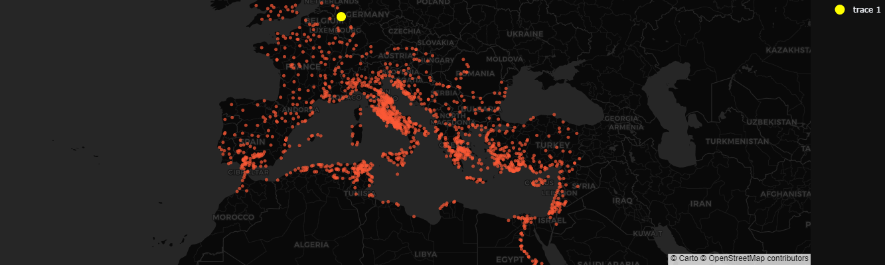
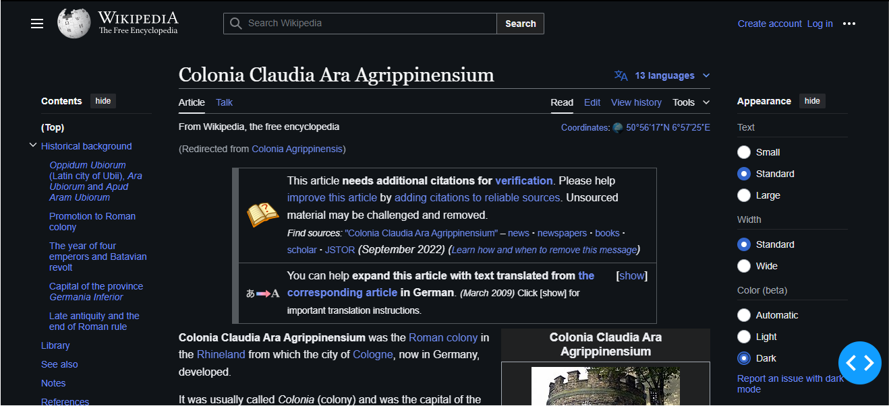

# A dashboard to explore the cities of the Roman Empire

Simple dashboard to visualize the appearance of new cities in the Roman Empire through time.

Clicking on each city on the map fetches the corresponding Wikipedia entry.

**To do:**
- make Wiki-entry retrieval more robust (preprocess names with parenthesis, etc.)
- retrieve Wiki entries automatically in dark-mode
